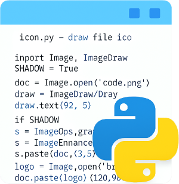
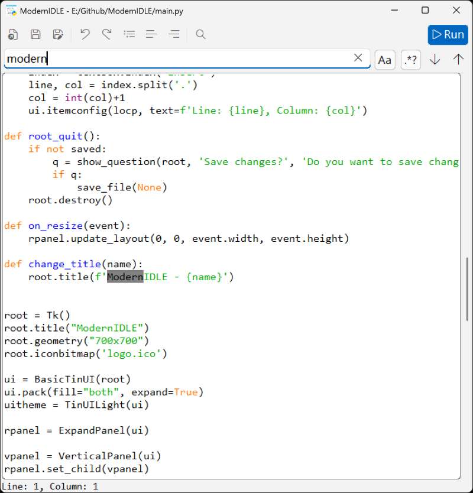

# ModernIDLE

A simple Python editor, built with TinUI (tkinter), with design references to IDLE

It is an experimental project, so command line is still needed for running Python scripts.

## screenshot

